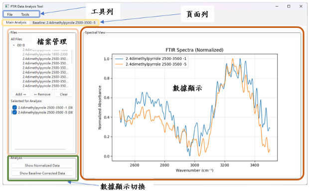
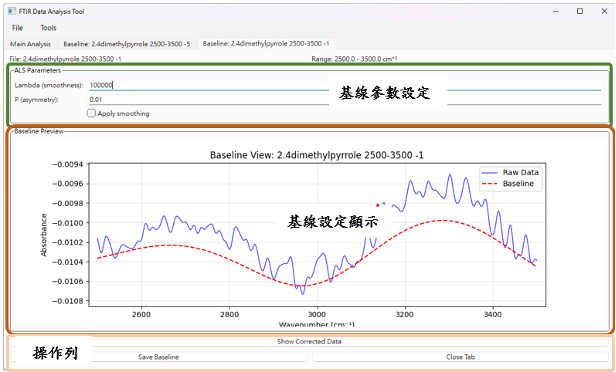

# 操作手冊
本手冊提供 FTIR 工具的基本使用說明，旨在協助使用者快速上手並有效操作本軟體。內容分為以下章節：
- [下載](#下載)
- [介面](#介面)
- [功能](#功能)

## 下載
### Source
若您熟悉原始碼操作，可選擇以下方式安裝：
1. 複製本工具的原始碼至本地端。
2. 參考 GitHub [說明文件](https://github.com/JRay-Lin/ftir-tools/blob/master/README.md)執行原始碼。此方式效率較高，但設定過程較為複雜。


### Windows
1. 前往 GitHub [發佈頁面](https://github.com/JRay-Lin/ftir-tools/releases)，下載最新版本的執行檔（檔案名稱格式為 ```xxx.exe```）
2. 下載完成後，雙擊執行檔即可使用。

### MacOS (apple silicon)
1. 前往 GitHub [發佈頁面](https://github.com/JRay-Lin/ftir-tools/releases)，下載最新的執行壓縮檔（檔案名稱格式為 ```xxx.app.zip```）
2. 解壓縮後，雙擊應用程式即可使用。

</br>

> [!NOTE]
> 由於執行檔案沒有經過簽章，因此Windows 及 MacOS 皆會跳出安全警告
 

## 介面
以下為軟體的主要介面示意圖：

*圖 1：軟體主畫面*


*圖 2：基線建立介面*

## 功能
工具列提供以下功能選項：

- **File**：檔案管理功能，如開啟、儲存檔案。
- **Add Folder**：新增資料夾以載入檔案。
- **Open Recent**：快速開啟最近使用的檔案或資料夾。
- **Export Current Graph as CSV**：將當前圖表資料匯出為 CSV 格式。
- **Export Current Graph as PNG**：將當前圖表匯出為 PNG 圖片。
- **Tools**：
  - **Reverse X-axis**：反轉 X 軸顯示。
  - **Hide Legend**：隱藏圖例。
  - **Show Coordinates on Hover**：滑鼠懸停時顯示座標資訊。

### 頁面列

頁面列顯示目前開啟的多個頁面，使用者可於不同頁面間切換，以管理不同資料或工作流程。

### 主畫面

主畫面包含以下核心區域：

- **檔案管理**
  - **All Files**：顯示所有已加入的資料夾及其檔案。點擊資料夾左側箭頭可展開或收起。
  - **Selected for Analysis**：顯示選取用於分析的檔案清單。
    - 雙擊檔案或選取後點擊 **Add**，可將檔案從 All Files 移至 Selected for Analysis。
    - 選取檔案後，雙擊或點擊 **Remove** 可將檔案移回 All Files；點擊 **Clear** 則清除所有選取檔案。
    - 勾選或取消選取框可控制檔案在數據檢視區的顯示。
    - 對 Selected for Analysis 中的檔案點擊右鍵，可開啟 **Create Baseline** 功能以建立基線。
- **數據顯示**\
  顯示目前開啟檔案的數據圖表。
- **數據顯示切換**
  - **Show Normalized Data / Absolute Values**：切換數據顯示為標準化（0\~1 區間）或原始值。
  - **Show Baseline Corrected / Raw Data**：切換顯示經基線校準的資料或原始數據。若資料未經基線校準但處於基線模式，曲線將顯示為虛線。

### 基線建立頁面

基線建立頁面提供進階數據處理功能：

- **基線參數設定**
  - **Lambda**：控制基線平滑度，數值越大基線越平滑，建議範圍為 10² \~ 10⁷（可用科學記號輸入，如 1e2 表示 1×10²）。
  - **P**：控制非對稱性，數值越大非對稱性越高，建議範圍為 0.001 \~ 0.1。
- **基線顯示**\
  顯示基線及校準後的資料。使用者可通過右鍵點擊基線新增錨點，手動調整基線形狀。錨點可使用 **Delete** 鍵刪除。
- **操作列**
  - **Show Corrected Data / Baseline View**：切換顯示基線原始值或校準後的資料。
  - **Save Baseline**：儲存當前基線設定。

- **Close Tab**：關閉基線建立頁面。
